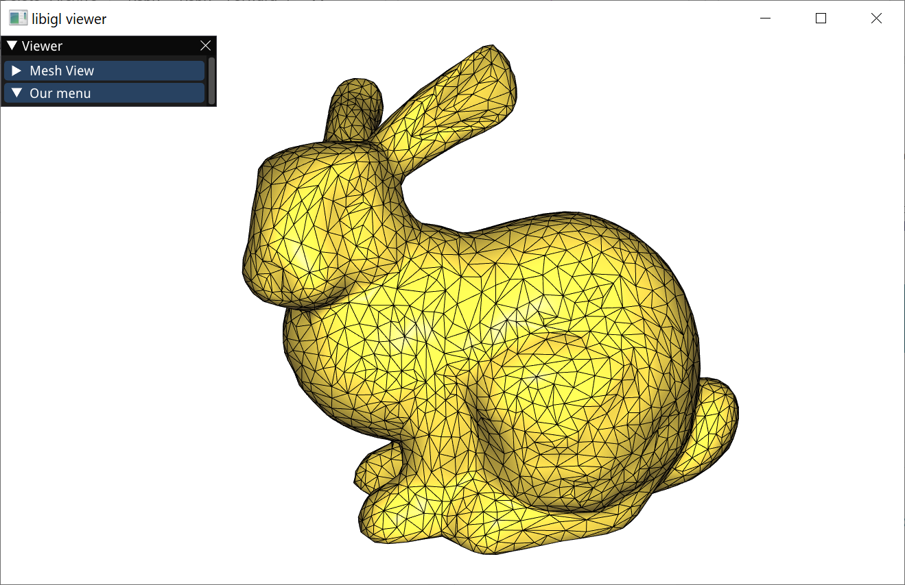

# A primer on Geometric Optimization


## Install tools
Install all of the following components **well before** the session. Note that some of these packages are **large** (multiple GB) and take time to download and install. Make sure to test everything to be ready to go.

If you are experienced in C++ and have everyting already setup, jump to [Building](#building) directly.

### (1) Development environment & C++ compiler
If you already have a C++ environment set up, skip this section and feel free to use your favorite editor, IDE, compilers, etc.  

If you don't have your toolchain set up already, I recommend installing IDEs that take of the toolchain for you:
* Windows: [Visual Studio](https://visualstudio.microsoft.com/vs/community/), which installs the MSVC compiler for you
* MacOS: [Xcode](https://developer.apple.com/xcode/), which installs clang for you

### (2) CMake
Install [CMake](https://cmake.org/download/), which is the build system that creates the C++ project, sets up dependencies, etc. If you are new to CMake, I recommend using the CMake GUI.

### (3) Boost C++ libraries
**Windows:**
1. Follow the [Boost install instructions](https://robots.uc3m.es/installation-guides/install-boost.html#install-boost-windows).
2. You might need to run the command prompt in admin mode. I recommend using the *Developer command prompt* that is installed by Visual Studio.
3. Check that a system variable in your environment variables was created: `BOOST_ROOT: <path-to-boost>\boost_1_77_0`. Create the variable if needed.

**MacOS:** 
1. Go to the terminal. Make sure you have brew installed by typing `brew -v`. If not, see [brew installation](https://docs.brew.sh/Installation).
2. Install boost by `brew install boost`.
3. Find the where boost is located by typing `brew info boost`. Its output should contain a path that looks like `/opt/homebrew/Cellar/boost/1.77.0_2`.
4. Run `export BOOST_ROOT=/opt/homebrew/Cellar/boost/1.77.0_2` (or whatever boost path you see in the previous step) to make sure your build system can find boost. Do this before building EVERYTIME.

## Building

### (1) Clone the code **recursively**
This project uses [libigl](https://github.com/libigl/libigl/) for geometry processing. See the [libigl tutorial](https://libigl.github.io/tutorial/).
Clone this repository with all dependencies, configured as submodules, using:
```
git clone --recursive https://github.com/alexiiion/teach-geometric-optimization.git
```

### (2) Build using CMake
On **Windows**, open the CMake GUI (see the image below). 
1. The source code folder is **this folder** (where this README is)  
2. The build folder should be contained in this folder, e.g., `<path-to-repo-root>/_build`
3. Click `Configure` and keep the settings (your Visual Studio version might be newer, keep `Use default native compilers` unless you know what you do.)


<!-- 4. At the end of the output `Configuration done.`  -->
4. Click `Generate`, which will create your project files, after successful configuration (indicated by `Configuration done.`)


On **MacOS**, you can also use the cmake-gui, as described above. Alterantively, from the root directory that contains `CMakeLists.txt`, run:

```
mkdir __build
cd __build
cmake ../
make
```

<!-- There are some warnings due to changes in the build system of libigl. It still works. After running cmake, the output should be `Configuring done`. -->

The line `cmake ../` will configure the project for you and `make` will build the project. Here is how your folder should look like after successful building: 

<span style="background-color: red; font-weight:bold; color: white"> UPDATE image </span>


### (3) Run the code

* **Windows**:
1. Open the `*.sln` file, which opens Visual Studio.
2. There, set the configuration to `RelWithDebInfo`.
3. Right click on the **`0_intro_igl`** project in the Solution Explorer and select `Set as Startup Project`.
4. Then compile using the little green arrow. This will take a while.

* **MacOS**:
1. Go to `__build` in your terminal.
2. Execute **`./0_intro_igl`**
3. It's unlikely, but if you see something like `zsh: permission denied: ./0_intro_igl`, try `chmod +x 0_intro_igl` before step 2.

This is the result of a successful compilation:


